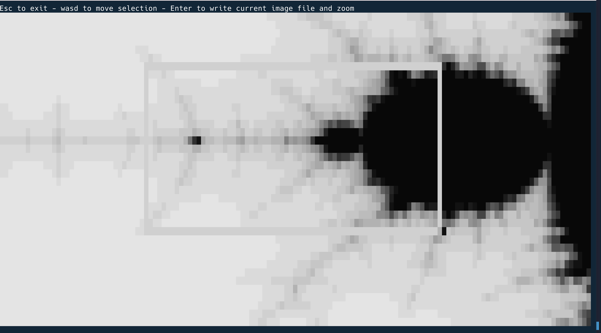
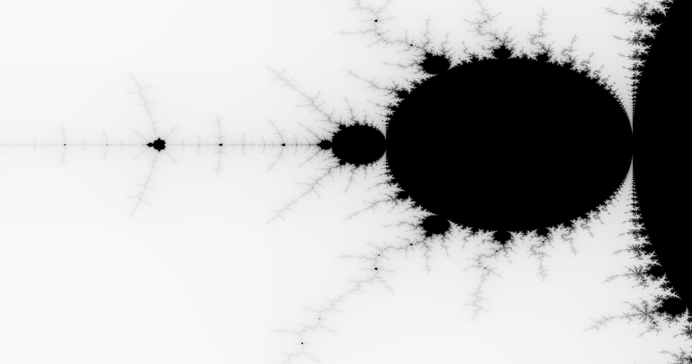

# rust-mandelbrot
This is an extension of the code you can find in the (excellent) book [Programming in Rust - 2nd Edition](https://www.oreilly.com/library/view/programming-rust-2nd/9781492052586/) that renders Mandelbrot sets to png files. I've added a TUI interface to enable viewing the image in the terminal, positioning and zooming into the image and the ability to render the current image as a PNG with a key press.

## Running

Currently, just like the book example, you pass in a filename, image size and window into the set using two complex numbers for the top left and bottom right corners respectively.

```
cargo run --release -- /tmp/mandel.png 2048x1080 -2.8,2.0 2.5,-2.0 1
```

Pressing Return/Enter will save the current image to the file path you give. Subsequent images are automatically 
numbered, so you will get mandel1.png, mandel2.png and so on. It will overwrite any existing images so save to 
a different folder each time.

Move the selection around with WASD keys and press Z to zoom. You can't zoom back out and accuracy issues will 
start to make the images very boring. These are both exercises for me in the future or for the interested reader.





## Issues

If you're interested in playing around with the code check out the Issues for things to do.
